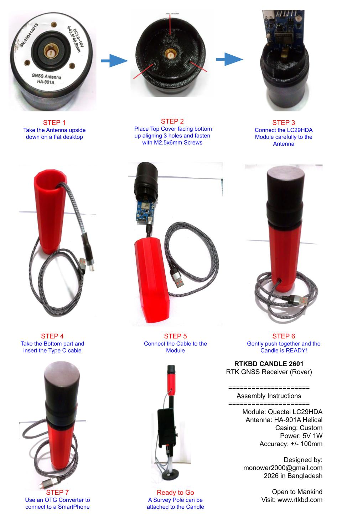

# RTK-Survey

আমার সেট আপ এখনো পরীক্ষামূলক, Quectel LC29H মডিউল কমবেশি ৩৫ ডলার আর এন্টেনা ৬৫ ডলার মোট ১০০ ডলার প্রতি সেট। RTK এর জন্য ২ সেট ২০০ ডলার বা ২৫ হাজার টাকা। কিন্তু এর সাথে অন্তত দুটি মোবাইল ফোন লাগবে, ট্রাইপড, কেসিং ইত্যাদি লাগবে। মোবাইল ফোন দিয়ে বেস ষ্টেশন চালানো বাস্তবসম্মত নয়। এর জন্য ছোট সিঙ্গেল বোর্ড কম্পিউটার, পাওয়ার ও নেটওয়ার্ক লাগবে। একটি কার্যকর ব্যবস্থা উদ্ভাবনের আগে খরচের হিসাব দেয়া সম্ভব নয়।

তবে কেউ টাকা থাকলে রেডিমেড সিস্টেম সংগ্রহ করতে পারেন, মোটামুটি এন্ট্রি লেভেলের সম্পূর্ণ সেট (SingularXYZ Z1 Base Rover Kit) ২০০০ ডলারের মধ্যে।

## সবসময় কন্ট্রোল পয়েন্ট সার্ভে মোডে পয়েন্ট নিতে হবে

## singularpad   Apk [ সোহেল ভাই মনোয়ার]

## Surpad 4.2 apk [ মোবাইল দিয়েও প্রেকটিস করা যা]

<!--[profile](./RTK.jpeg)-->

