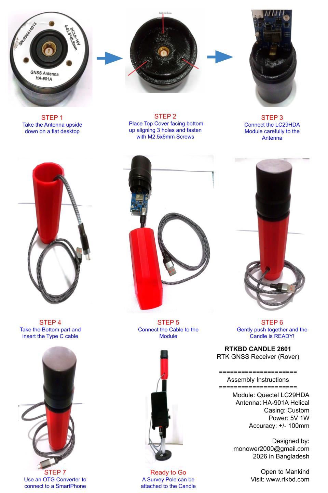
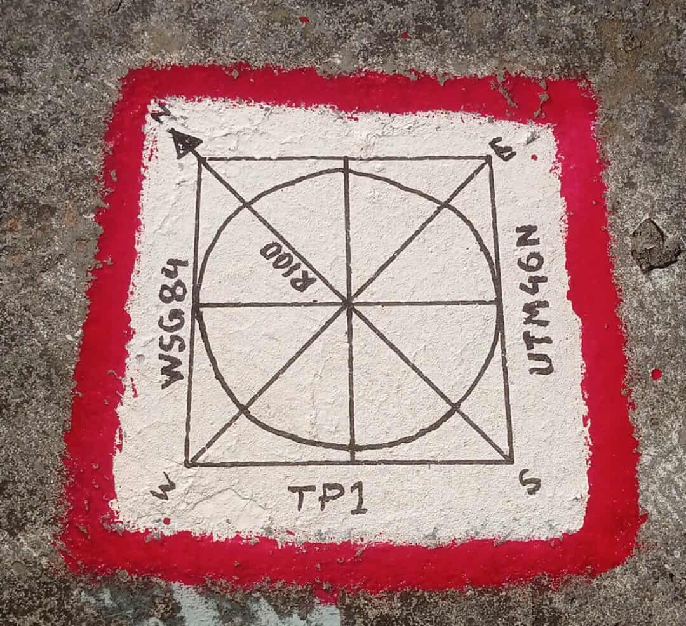
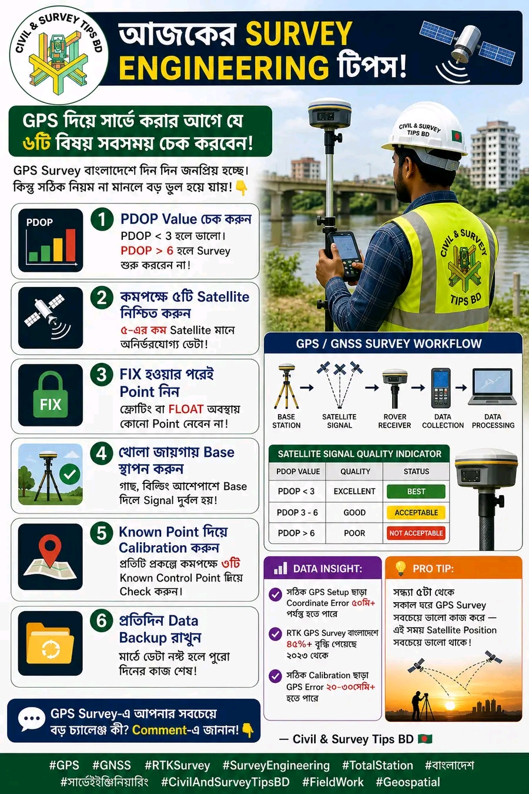
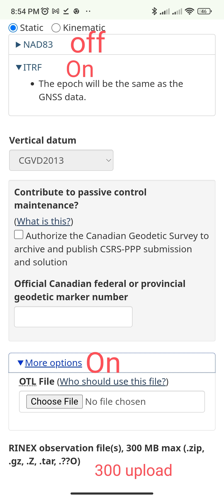

# RTK-Survey

আমার সেট আপ এখনো পরীক্ষামূলক, Quectel LC29H মডিউল কমবেশি ৩৫ ডলার আর এন্টেনা ৬৫ ডলার মোট ১০০ ডলার প্রতি সেট। RTK এর জন্য ২ সেট ২০০ ডলার বা ২৫ হাজার টাকা। কিন্তু এর সাথে অন্তত দুটি মোবাইল ফোন লাগবে, ট্রাইপড, কেসিং ইত্যাদি লাগবে। মোবাইল ফোন দিয়ে বেস ষ্টেশন চালানো বাস্তবসম্মত নয়। এর জন্য ছোট সিঙ্গেল বোর্ড কম্পিউটার, পাওয়ার ও নেটওয়ার্ক লাগবে। একটি কার্যকর ব্যবস্থা উদ্ভাবনের আগে খরচের হিসাব দেয়া সম্ভব নয়।

তবে কেউ টাকা থাকলে রেডিমেড সিস্টেম সংগ্রহ করতে পারেন, মোটামুটি এন্ট্রি লেভেলের সম্পূর্ণ সেট (SingularXYZ Z1 Base Rover Kit) ২০০০ ডলারের মধ্যে।

## সবসময় কন্ট্রোল পয়েন্ট সার্ভে মোডে পয়েন্ট নিতে হবে

## Configuration Methods
## Configuration Menus

## singularpad   Apk [ সোহেল ভাই মনোয়ার]

## Surpad 4.2 apk [ মোবাইল দিয়েও প্রেকটিস করা যা]

## 100% $ignal 

GPS (1004, 1077)

GLONASS (1012, 1087)

Galileo (1097)

BeiDou (1127)

SBAS (1107)

<!--[profile](./RTK.jpeg)-->

<!--[profile](./bm.jpg)-->

## Trilateration সম্পর্কে জান্তে হবে।

# RTK command

$PQTMRESTOREPAR*13

$PQTMSAVEPAR*5A

## GNSS System Select (কোন স্যাটেলাইট ব্যবহার করবে) এই সফটওয়্যারে তুমি GNSS module-এ PMTK / PQTM কমান্ড দাও

$PQTMGNSSSELECT,1*hh   // GPS only

$PQTMGNSSSELECT,2*hh   // GLONASS

$PQTMGNSSSELECT,3*hh   // GPS+GLONASS

$PQTMGNSSSELECT,7*hh   // All (GPS+GLONASS+BeiDou+Galileo)

## RTCM Output enable (সবচেয়ে গুরুত্বপূর্ণ)

## Survey-in (Auto position)

(1) $PQTMSURVEY,1,<time>,<accuracy>*xx

(2) $PQTMSURVEY,1,300,1.0*xx

👉 মানে:
1 = Start Survey-in
300 = 300 seconds (5 min)
1.0 = 1 meter accuracy limit

<!--[profile](./g.jpg)-->

## Geolocate

## 100% PPP RtK দিয়ে [ সুহেল sir] 
##. ubx file এর ভিতরে Rxm raw data থাকে এবং RXM raw measurement (PPP/PPK-এর জন্য গুরুত্বপূর্ণ)

(2) configure GNSS massages

(11) turn off all massage [ অব্যশই বন্দ করতে হবে ]  এটা করা হয় যাতে GNSS receiver অপ্রয়োজনীয় message পাঠানো বন্ধ করে।

(12) Reset to ppp Loggine Defoult ( NMEAX5+Rx) [ এটা করলে PPP-এর জন্য দরকারি data configuration default ভাবে সেট হয়।ঠিকভাবে enable হয়, যাতে পরে RINEX বানানো যায় এবং PPP process করতে সুবিধা হয়। 

(x) exit

(x) exit

(b) exit Bluetooth Echo mode [ অব্যশই বন্দ করতে হবে]

## Enable এবং টাইম সেট করতে হবে 

Log to microSD: Enabled

19:50:05.362 2) Set max logging time: 120 minutes

19:50:05.362 3) Set max log length: 120 minutes

19:50:05.372 5) Log Antenna Reference Position from RTCM 1005/1006: Enabled

## . ubx file কে RINEX convert 

https://github.com/tomojitakasu/RTKLIB

## PPP upload file .obs 

sing:- https://webapp.csrs-scrs.nrcan-rncan.gc.ca/geod/account-compte/login.php

ppp upload:- https://webapp.csrs-scrs.nrcan-rncan.gc.ca/geod/tools-outils/ppp.php

<!--[profile](./B.jpg)-->

